# Query DDL Database

## Create Table Customers
Mendefinisikan table customers yang berisi kolom id dan customer_name\
Command: 
```
    create table customers (id SERIAL NOT NULL PRIMARY KEY, customer_name char(50) NOT NULL);
```
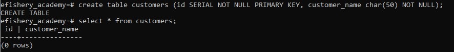

## Create Table Products
Mendefinisikan table products yang berisi kolom id dan name\
Command: 
```
    create table products (id SERIAL NOT NULL PRIMARY KEY, name char(50) NOT NULL);
```
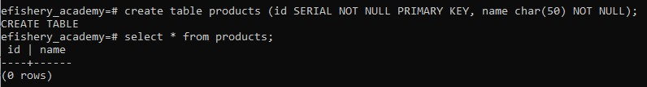

## Create Table Orders
Mendefinisikan table orders yang berisi kolom order_id, customer_id, product_id, order_date, dan total\
Command: 
```
    create table orders (order_id SERIAL PRIMARY KEY NOT NULL, customer_id int REFERENCES public.customers (id) NOT NULL, product_id int REFERENCES public.products (id) NOT NULL, order_date date NOT NULL, total float NOT NULL);
```
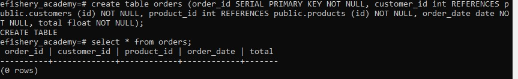


# Query DML Database

# Customer Table Section
## Insert Table Customers
Menambahkan data ke table customers\
Command:
```
    insert into public.customers (customer_name) values ('Wiryawan'), ('Yurih');
```
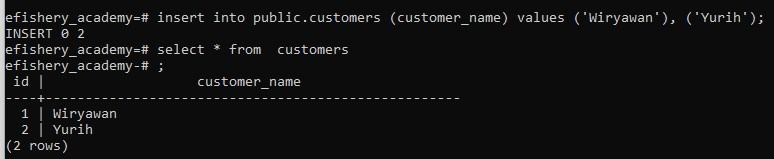

## Update Table Customers
Mengupdate data yang telah terinput ditable customers\
Command: 
```
    update public.customers set customer_name = 'Yurih Kaloko' where id = 2;
```
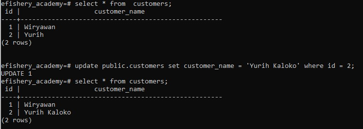

## Delete Table Customers
Menghapus data yang telah terinput ditable customers\
Command:
```
    delete from public.customers where id = 4;
```
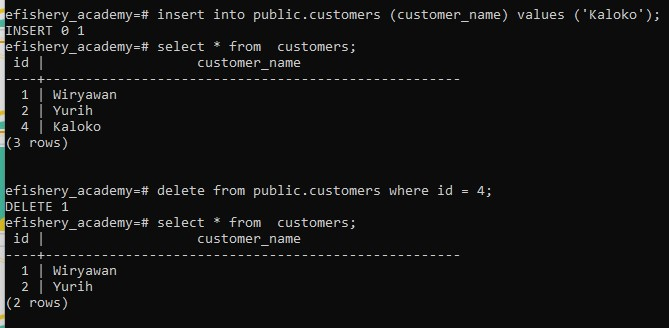


# Products Table Section
## Insert Table Products
Menambahkan data ke table products\
Command:
```
    insert into public.products (name) values ('Sikat Gigi'), ('Pasta Gigi'), ('Shampoo'), ('Sabun'), ('Handuk');
```
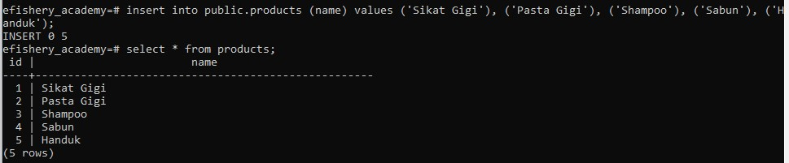

## Update Table Products
Mengupdate data yang telah terinput ditable products\
Command: 
```
    update public.products set name = 'Sabun Cuci Muka' where id = 4;
```
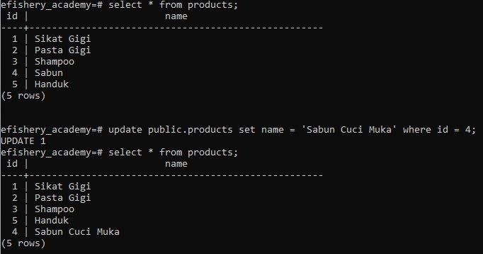

## Delete Table Products
Menghapus data yang telah terinput ditable products\
Command:
```
    delete from public.products where id = 5;
```
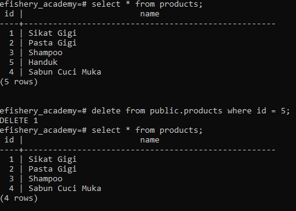


# Orders Table Section
## Insert Table Orders
Menambahkan data ke table orders\
Command:
```
    insert into public.orders (customer_id, product_id, order_date, total) values (1, 1, '19/08/2022', 2000), (1, 3, '20/08/2022', 2300), (2, 4, '21/08/2022', 1900), (2, 2, '22/08/2022', 1900), (1, 2, '23/08/2022', 2010);
```
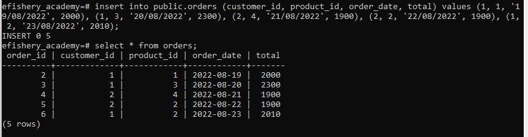

## Update Table Orders
Mengupdate data yang telah terinput ditable orders\
Command: 
```
    update public.orders set product_id = 1, total = 2000 where order_id = 4;
```
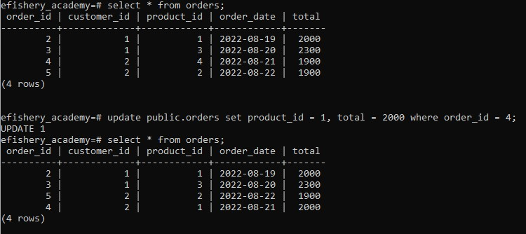

## Delete Table Orders
Menghapus data yang telah terinput ditable orders\
Command:
```
    delete from public.orders where order_id = 6;
```
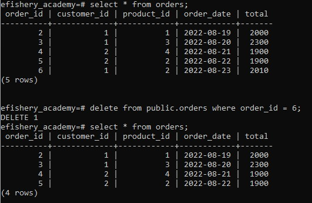


# Query Join Database

## Inner Join Table Orders
Mengambil data menggunakan inner join dari 3 table yakni, customer, products, dan orders\
Command:
```
    select TOR.order_id, TC.customer_name, TP.name AS product_name, TOR.total, TOR.order_date from public.orders AS TOR INNER JOIN public.customers AS TC on TOR.customer_id = TC.id INNER JOIN public.products AS TP on TOR.product_id = TP.id;
```
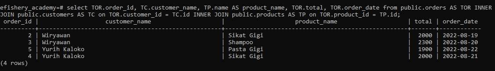