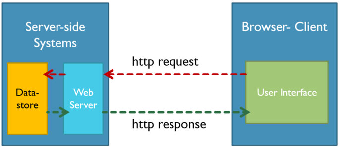

# Summary Day 6

## Rest API
REST API ini merupakan dari kata REST(Representational State Transfer) yang artinya adalah arsitektur\
perangkat lunak yang memberlakukan syarat mengenai cara API bekerja. REST API juga merupakan cara\
mengakses layanan web dengan cara yang sederhana dan fleksibel tanpa melakukan pemrosesan apa pun.\
Metode komunikasi yang digunakan oleh REST API ini menggunakan protokol HTTP untuk pertukaran data\
dimana metode ini sering diterapkan dalam pengembangan aplikasi. Tujuannya untuk menjadikan sistem\
memiliki performa yang baik, cepat dan mudah untuk dikembangkan.


## HTTP/HTTPS
Hypertext Transfer Protocol (HTTP) adalah protokol tingkat aplikasi/website untuk sistem informasi\
terdistribusi, kolaboratif, dan hypermedia. Sedangkan, Hypertext Transfer Protocol Secure (HTTPS)\
adalah protokol HTTP yang dienkripsi untuk mengamankan komunikasi antar layanan. Protokol HTTPS ini\
masuk kedalam Transport Layer Security (TLS).


\Cara kerja HTTP/HTTPS


## HTTP Headers
HTTP Header berfungsi untuk memfasilitasi klien dan server menyampaikan informasi tambahan dengan\
menggunakan HTTP request atau response. Header HTTP terdiri dari case-insensitive name yang diikuti\
oleh titik dua(:) kemudian dilanjut dengan valuenya.


## HTTP Messages/Body/Payload
HTTP messages/body/payload adalah cara data dipertukarkan antara server dan klien. Pada HTTP message\
ini Ada dua jenis pesan, yakni request yang dikirim oleh klien untuk memicu action dari server dan \
server akan mengirimkan response.


## Method Rest API
Ada beberapa method yang digunakan oleh Rest API, yakni:
1. GET
2. POST
3. PUT
4. PATCH
5. DELETE


## HTTP Response Code
HTTP Response Code adalah kode standarisasi dalam menginformasikan hasil request kepada client. \
Secara umum terdapat 3 kelompok yang biasa kita jumpai pada RESTful API yaitu :
1. 2XX : adalah response code yang menampilkan bahwa request berhasil.
2. 4XX : adalah response code yang menampilkan bahwa request mengalami kesalahan pada sisi client.
3. 5XX : adalah response code yang menampilkan bahwa request mengalami kesalahan pada sisi server.


## JSON (JavaScript Object Notation)
JSON adalah format pertukaran data yang ringan digunakan. Dengan JSON akan memudahkan untuk manusia\
dan mesin dalam membaca, menulis, hingga menguraikannya.


## Authorization
JSON Web Token (JWT) adalah standar sebuah Token yang mendefinisikan sebuah informasi dan mentransmisikan\
informasi tersebut ke antar pihak secara aman dengan objek JSON. JWT sendiri dapat diamankan dengan sign\
secara digital dan secara rahasia dengan algoritma HMAC atau menggunakan kunci public/private menggunakan\
RSA atau ECDSA.

Dalam Authorization ini terdapat 3 komponen, yakni:
1. Header    : yang berisi algoritma dan tipe dari Token
2. Payload   : yang berisi klaim, klaim disini adalah pernyataan tentang suatu entitas biasanya data user atau data tambahan
3. Signature : yang berfungsi untuk membuat sign yang ditujukan untuk encoded header, payload, serta algoritma yang tersimpan di Header


## Tools API
Ada beberapa Tools API yang bisa digunakan, yakni Postman dan Insomnia.

Dalam Postman sendiri memiliki fitur berikut:
1. Creating Request
2. Adding Request Detail
3. Receiving Responses
4. Grouping Request in collection
5. Using Variables


## Echo Framework
Echo adalah framework bahasa golang untuk pengembangan aplikasi web dan framework ini cukup terkenal dikomunitas Golang.
Fitur dalam Echo Framework sebagai berikut:
1. Optimize Router
2. Scalable
3. Automatic TLS
4. HTTP/2
5. Middleware
6. Data Binding
7. Data Rendering
8. Many Templates 
9. Extensible

Cara menginstallnya:
```
    go get github.com/labstack/echo/v4
```


## Unit Testing
Unit Testing adalah proses pengembangan perangkat lunak dimana bagian terkecil dari aplikasi dapat diuji. \
Unit testing ini biasanya ditest secara individual dan independen operation yang tepat.

Cara melakukan unit Testing di Golang:
1. File pengujian unit harus berformat name_ testing.go dalam paket yang sama
2. Unit test di GOlang ditulis dalam bentuk function, yang memiliki parameter tipe *testing.T


## Logging
file log adalah file yang merekam peristiwa baik yang terjadi dalam sistem operasi atau perangkat lunak lain\
yang berjalan, atau pesan antara pengguna yang berbeda dari perangkat lunak komunikasi. Logging adalah tindakan\
menyimpan log.

Fungsi dari log:
1. Menemukan bug diaplikasi
2. Menemukan error dalam perfomance aplikasi
3. Melakukan analisis pada security incidents

Golang Log Fremework yang banyak digunakan, sebagai berikut:
1. Glog
2. Logrus