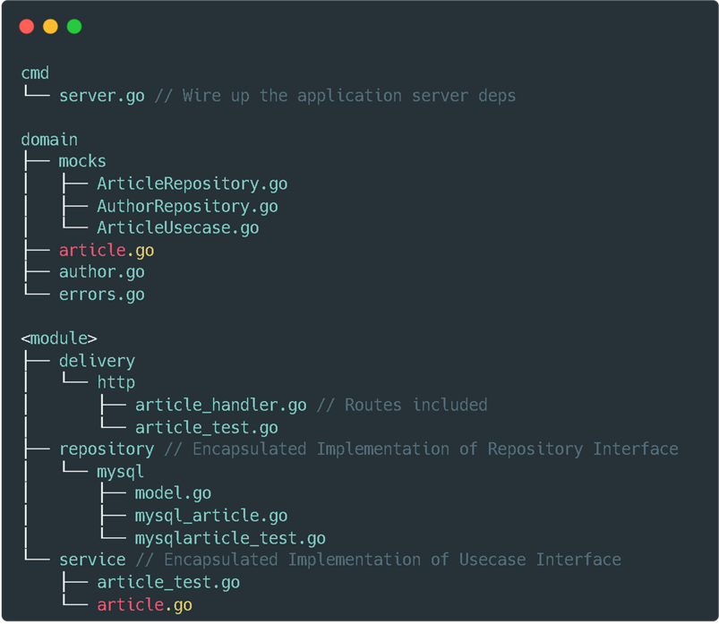

# Summary Day 7

## ORM
Object-Relational Mapping (ORM) adalah teknik yang memungkinkan Anda melakukan Query dan memanipulasi\ 
data dari database menggunakan paradigma berorientasi objek.


## GORM
GORM merupakan library ORM untuk Golang

Install GORM
```
  //Installation
  Go get -u gorm.io/gorm
  Go get -u gorm.io/drivers/postgres
```

Connect Database
```
  //Connect to Database
  Import {
    “gorm.io/drivers/postgres”
    “gorm.io/gorm” 
  }

  Dsn := “host=localhost user=gorm password=gorm port=9920 sslmode=disable TimeZone=Asia/Shanghai”

  Db, err := gorm.open(postgres.Open(dsn)), &gorm.Config{})
```

Retrieving Single Data
```
  //Retrieving Single Data
  Db.First(&user)

  Db.Take(&user)

  Db.Last(&user)
  Result := Db.First(&user)
  Result.RowsAffected
  Result.Error

  Errors.Is(Result.Error, gorm.ErrRecordNotFound)
```

Query Create
```
  //Query Create
  User := User {Name: “Jinzhu”, Age: 18, Birthday: time.Now()}
  Result := db.create(&user)

  User.ID
  Result.Error
  Result.RowsAffected
```

Query Update
```
  //Query Update
  Db.First(&user)

  User.Name= “Jinzhu 2”
  User.Age = 100
  Db.Save(&user)
```

Query Delete
```
  //Query Delete
  db.Delete(&email)

  db.Where (“name = ?”, “jinzhu”).Delete(&email)
```

Query Join
```
  Query Join
  Type result struct{
  Name string
  Email string
  }
  Db.Model(&User{}). Select(“users.name, emails.email”).Joins(“left join emails on emails.user_id = users.id”). Scan (&result{})

  Rows, err := db.Table(“users”).Select(“users.name, emails.email”).Joins (“left join emails on emails.user_id = users.id”).Rows ()
  For rows.Next(){
    . . .
  }
  Db.Table(“users”).Select(“users.name, emails.email”).Joins(“left join emails on emails.user_id = users.id”).Scan(&result)
```


## Middleware
Middleware adalah sebuah kode yang dijalankan sebelum atau sesudah http. Sederhananya sebuah aplikasi\
dibungkus dengan Middleware. Middleware biasanya digunakann untuk authentication, logging


## Environment Variable
Environment Variables adalah variabel yang berada di lapisan runtime sistem operasi. Karena Environment\
Variable adalah variabel seperti biasa, kita dapat melakukan operasi seperti mengubah nilainya atau\
mengambil nilainya.

Sample Code
```
  condAppName := os.Getenv(“APP_NAME”)
  if confAppName == “” {
        e.Logger.Fatal (APP_NAME config is required)
  }
```


## Clean Architecture
Clean architecture adalah filosofi desain perangkat lunak yang memisahkan elemen desain menjadi level\ 
cincin

Kelebihan dalam penggunaan Clean Architecture
●	Testable
●	Maintainable
●	Changeable
●	Easy to Develop
●	Easy to Deploy
●	Independent

The Directory Structure Architecture
Berikut direktori yang mengadopsi Clean Architecture:



The Flow Clean Architecture
Berikut flow dari Clean Architecture:
