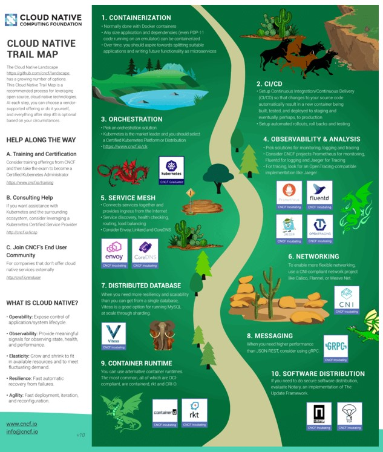
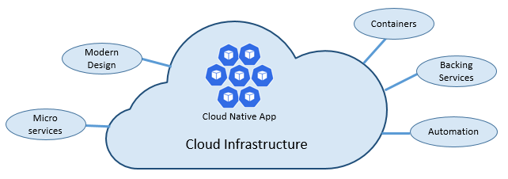
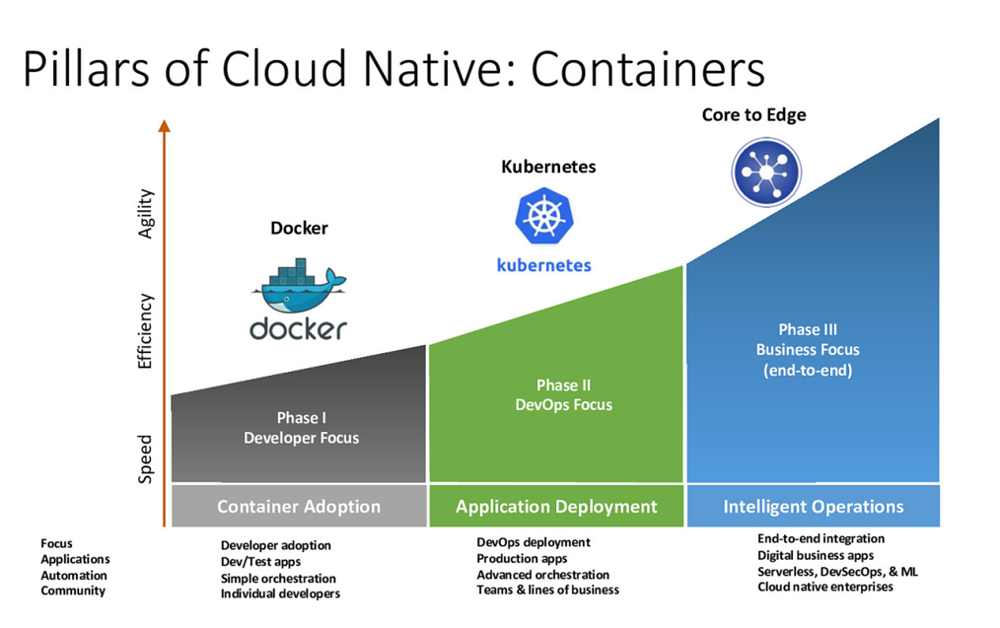
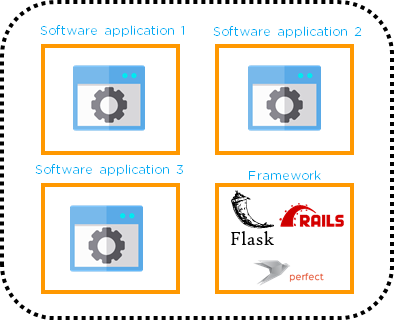
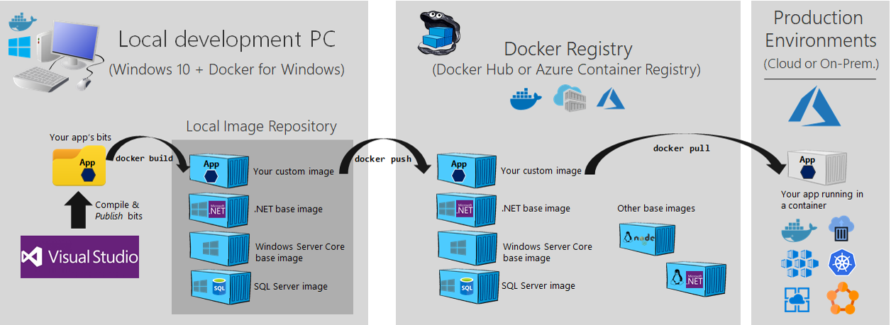
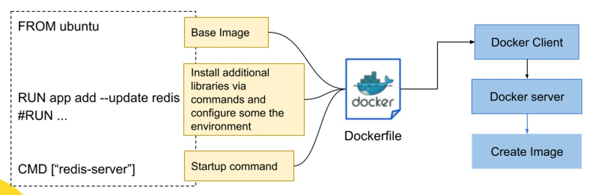
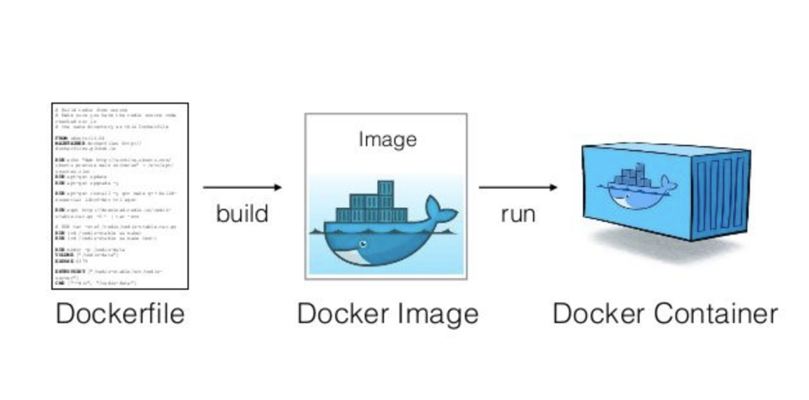

# Summary Day-8

## Cloud Native
Cloud native Adalah pendekatan untuk merancang, membangun, dan mengoperasikan beban kerja yang\
dibangun dicloud dan memanfaatkan sepenuhnya model komputasi cloud. Hal ini merupakan paradigma\
komputasi baru yang dioptimalkan untuk lingkungan sistem terdistribusi modern, yang mampu\
menskalakan hingga puluhan ribu multi-tenant nodes yang dapat menyembuhkan sendiri.

\
Cloud Native Trail Map

## The pillars of Cloud Native
1. Micro services
2. Modern design
3. Containers
4. Backing services
5. Automation 

## The Twelve-Factor Application
1. Codebase
2. Dependencies
3. Configuration
4. Backing Service
5. Build, Release, Run
6. Process
7. Port Binding
8. Concurrency
9. Disposability
10. Dev/Prod Parity
11. Logging
12. Admin Process

## Containers

Container

## Containerization
Containerization adalah sebuah abstraksi pada lapisan aplikasi yang mengemas kode dan dependensi\
bersama-sama

\
Analogy Container

\
Containerization in Software Engineering

## Docker
## Docker Registry

1. Registry adalah layanan yang berisi penyimpanan gambar yang merespons Registry API.
2. Registry lokal adalah tempat menyimpan gambar yang Anda buat atau tarik
3. Registry jarak jauh atau yang dihosting adalah tempat Anda pull gambar atau push gambar

## Docker File
\
Docker file adalah sebuah dokumen teks yang berisi semua perintah yang dapat dipanggil pengguna\
pada baris perintah untuk merakit gambar

## Docker Image
Docker image adalah template read-only dengan instruksi untuk membuat container Docker

## Docker Container
\
Gambar diatas merupakan gambaran sebuah instance dari image yang dijalankan