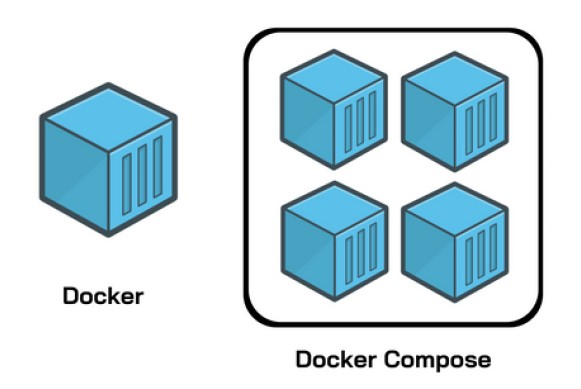
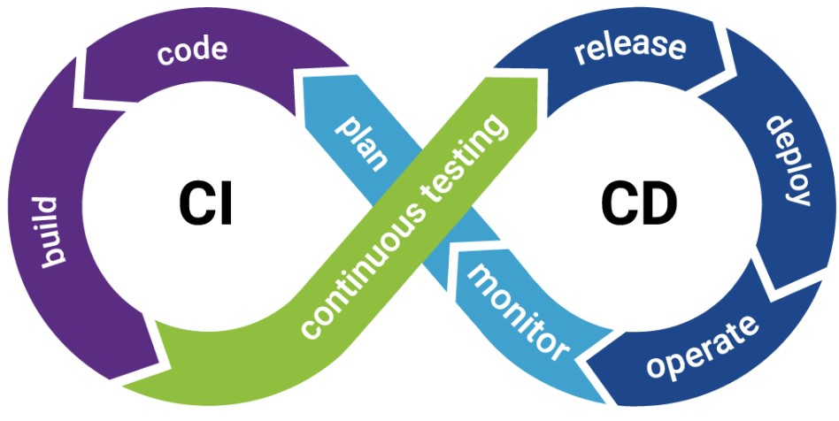

# Summary Day 9

## Docker Orchestration
Container Orchestration adalah sebuah tools automation untuk mengurangi beban operasional yang diperlukan untuk menjalankan beban kerja dan layanan dalam container provisioning, deployment, scaling, networking, load balancing, dan lain-lain. Sedangkan, Docker Orchestration adalah alat untuk mengelola Docker container dalam skala besar. Kemudian,perbedaan antara docker dengan docker compose ialah docker compose memungkinkan semua kontainer berjalan bersamaan dalam satu waktu.


## Docker Compose

Docker Compose adalah alat untuk menjalankan satu atau beberapa container yang saling terkait dengan sebuah command.



Karakteristik Docker Compose :

1. Cara define environment aplikasi bisa menggunakan `dockerfile`
2. Cara define multi container bisa menggunakan `docker-compose.yaml` atau `docker-compose.yml`
3. Cara deploy aplikasi `docker-compose up`

Contoh `docker-compose.yml` :
```
version: "3.9"  # optional since v1.27.0
services:
  web:
    build: .
    ports:
      - "8000:5000" # port kiri bisa diakses oleh kita sdgkn kanan dikases oeh container
    volumes:
      - .:/code
      - logvolume01:/var/log
    depends_on:
      - redis
  redis:
    image: redis
volumes:
  logvolume01: {}
```


## Volume

Volume adalah direktori tempat menyipan data sementara dan dapat diakses ke container dalam sebuah pod. Volume disimpan dibagian sistem file host yang dikelola oleh Docker (`/var/lib/docker/volumes/` di Linux). Proses non-Docker tidak boleh memodifikasi bagian sistem file ini. 


## Network

Network merupakan salah satu penyebab docker container dan service menjadi powerfull, karena network membuat container menjadi bisa saling berkomunikasi dengan non-docker workload.

## Continuous Integration/Continuous Delivery (CI/CD)

Continuous integration (CI) adalah proses integrasi code kedalam repositori, lalu menjalankan pengujian secara otomatis. CI dapat dilakukan dengan menggunakan command  `commit`. Sedangkan, Continuous Delivery atau Continuous Deployment (CD) adalah proses yang dilakukan setelah proses CI selesai dan seluruh kode berhasil terintegrasi, sehingga aplikasi bisa dibangun lalu dirilis secara otomatis.

**Keuntungan CI/CD :**

- Mendapat feedback lebih cepat
- Dapat mendeteksi bug lebih cepat
- Dapat mempercepat proses rilis

**CI/CD lifecycle :**


**Tools CI/CD**

- Jenkins
- Azure DevOps
- GitLab CI/CD
- Github Action


## Observability

Observability adalah sebuah proses untuk mengukur metrics, log, dan tracing.

**Kelebihan observability :**
- application performance monitoring (APM)
- DevSecOps dan site reliability engineer (SRE)
- monitoring infrastucture, cloud, dan kubernetes
- end user experience
- business analytics

**Komponen dalam sistem observable :**
- membuat logs
- membuat metric
- membuat distributed tracing
- membuat user experience

**Tantangan dalam Observability :**
- data silos
- volume, velocity, varety, complexity
- manual instrumentation and configuration
- lack of pre-production
- wasting time troubleshooting

## Tools observability

1. Dynatrace
2. Lightrun
3. Lumigo
4. Lightstep
5. Anodot
6. Datadog
7. Grafana
8. Honeycomb
9. New Relic